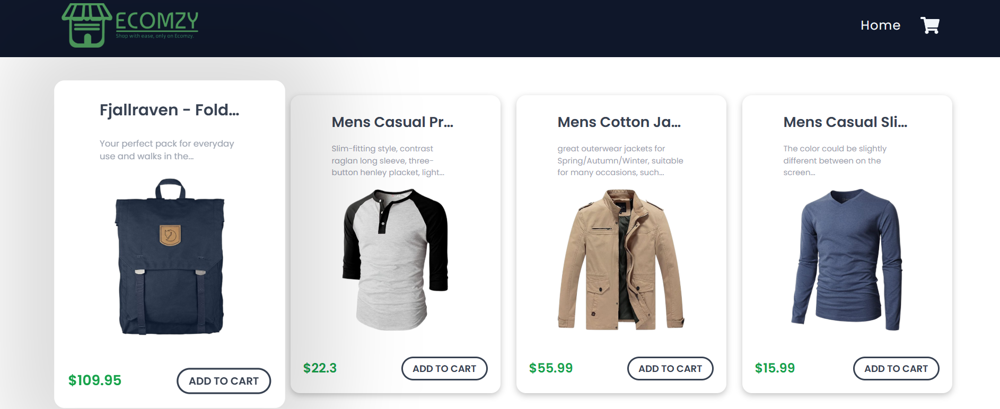
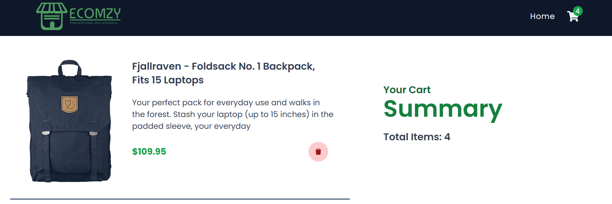

# 📦 React Redux Shopping App
  A simple **shopping cart application** built with **React** and **Redux**. This project demonstrates state management, product listing, cart functionality, and a smooth shopping experience.

---

## 🚀 Features
- 🛍️ Browse a list of products
- ➕ Add/Remove items from cart
- 🧮 Increase/Decrease item quantity
- 💰 Auto-calculated total price
- 🗑️ Clear entire cart
- 🔄 State management with Redux Toolkit
- 🎨 Styled with CSS/Tailwind (adjust if you used another method)

---

## 🛠️ Tech Stack
- React (frontend framework)
- Redux Toolkit (state management)
- React Redux (bindings)
- Vite / CRA (depending on your setup)
- CSS / TailwindCSS (styling)

---

# react-redux-shopping-app/
- │-- public/              # Static assets
- │-- src/
- │   │-- components/      # Reusable UI components
- │   │-- redux/           # Redux slices & store
- │   │-- pages/           # App pages
- │   │-- App.js           # Root component
- │   │-- index.js         # Entry point
- │-- package.json
- │-- README.md

---

## ⚙️ Installation & Setup 
1. Clone the repository
   git clone https://github.com/indrajeetPanjiyar/react-redux-shopping-app.git
   cd react-redux-shopping-app

2. Install dependencies
   npm install
   
3. Run the app locally
   npm start

4. Build for production
   npm run build

---

## 📸 Screenshots
- Product Page
  

- Cart Page
  

---

## 🧑‍💻 Usage
- Open the app in your browser.
- Browse available products.
- Add products to your cart.
- Modify quantity or remove items.
- View total cost dynamically updated.

---
